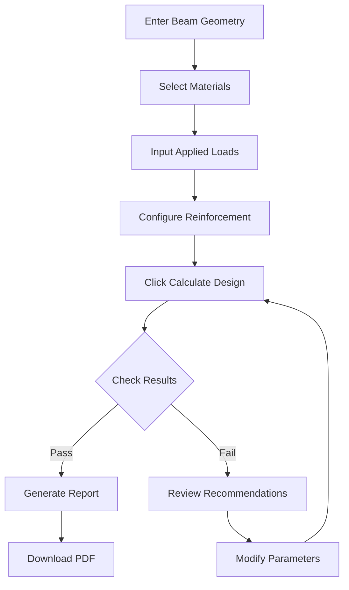

# 🏗️ Advanced Concrete Beam Design (NSCP 2015)

> Professional 3D visualization and comprehensive reinforced concrete beam design tool

[](LICENSE)
[](https://www.asep.org.ph/)
[](https://threejs.org/)
[](https://github.com/parallax/jsPDF)

**Advanced Concrete Beam Design** is a state-of-the-art web application for structural engineers to design reinforced concrete beams according to NSCP 2015 standards. It features real-time 3D visualization, comprehensive design calculations, detailed bar layout analysis, and professional PDF report generation.

*Developed by* **Engr. Lowrence Scott D. Gutierrez**

---

## 🌟 Key Features

### 🎯 Comprehensive Design Capabilities

- **Complete NSCP 2015 Compliance**: Follows all Philippine structural code requirements
- **Singly & Doubly Reinforced Design**: Automatically determines optimal reinforcement type
- **Flexural Design**: Moment capacity analysis with strain compatibility
- **Shear Design**: Complete shear reinforcement design with stirrup spacing
- **Bar Layout Analysis**: Advanced spacing validation and multi-layer arrangements
- **Strain Analysis**: Detailed compatibility checks and section behavior classification

### 🖼️ Advanced 3D Visualization

- **Interactive 3D Model**: Real-time beam and reinforcement visualization
- **Mouse Controls**: Rotate, zoom, and pan for complete model inspection
- **Toggle Views**: Wireframe mode and reinforcement visibility controls
- **Cross-Section Views**: Three detailed section cuts (left, middle, right)
- **Material Rendering**: Realistic concrete and steel representations
- **Shadow Mapping**: Enhanced depth perception with dynamic shadows

### 📊 Professional Reporting

- **Comprehensive PDF Reports**: Multi-page detailed design documentation
- **Visual Diagrams**: Cross-sections, moment diagrams, shear diagrams
- **Code Compliance Matrix**: Complete verification checklist
- **Professional Layout**: Print-ready with engineer seal space
- **Calculation Details**: Step-by-step design process documentation

### 💻 User Experience

- **Real-Time Updates**: Instant recalculation on parameter changes
- **Responsive Design**: Works seamlessly on desktop, tablet, and mobile
- **Modern UI**: Gradient backgrounds with glassmorphism effects
- **Intelligent Validation**: Automatic design checks and recommendations
- **Detailed Feedback**: Clear status indicators and design guidance

---

## 📋 Prerequisites

### Required
- **Modern Web Browser**: Chrome 90+, Firefox 88+, Safari 14+, or Edge 90+
- **JavaScript Enabled**: Required for all calculations and 3D rendering
- **WebGL Support**: For 3D visualization (available in all modern browsers)

### Recommended
- **Screen Resolution**: 1400x900 or higher for optimal three-panel layout
- **RAM**: 4GB+ for smooth 3D rendering
- **Processor**: Modern CPU for real-time calculations

---

## 🚀 Getting Started

### Installation

1. **Download the HTML file**
```bash
git clone https://github.com/SC0L0W/Concrete-Beam-Design-NSCP2015.git
cd Concrete-Beam-Design-NSCP2015
```

2. **Open in browser**
```bash
# Simply double-click the HTML file or open in browser
# No server installation required!
```

3. **Start designing**
   - Enter beam geometry and properties
   - Adjust loading conditions
   - View real-time 3D model updates
   - Generate professional reports

### Quick Start Example

```javascript
// Default values for quick testing:
Beam Width: 300mm
Beam Height: 500mm
Concrete: C28 (28 MPa)
Steel: Grade 414
Moment: 200 kN⋅m
Shear: 120 kN
```

---

## 💡 Usage Guide

### 1️⃣ Input Parameters

#### Beam Geometry
| Parameter | Description | Range | Units |
|-----------|-------------|-------|-------|
| **Width (b)** | Beam cross-section width | 150-1000 | mm |
| **Height (h)** | Beam cross-section height | 200-1500 | mm |
| **Length (L)** | Beam span length | 2-20 | m |
| **Cover** | Concrete cover to stirrups | 20-75 | mm |

#### Material Properties
| Material | Grades Available | Typical Use |
|----------|-----------------|-------------|
| **Concrete** | C21, C28, C35, C42 | C28 most common |
| **Main Steel** | 276, 414, 500 MPa | Grade 414 standard |
| **Stirrup Steel** | 276, 414 MPa | Grade 276 typical |

#### Applied Forces
| Force Type | Symbol | Description |
|------------|--------|-------------|
| **Positive Moment** | Mu+ | Bottom fiber tension |
| **Negative Moment** | Mu- | Top fiber tension |
| **Shear Force** | Vu | Maximum factored shear |
| **Axial Force** | Nu | Compression/tension |
| **Torsion** | Tu | Twisting moment |

#### Reinforcement Details
| Parameter | Options | Notes |
|-----------|---------|-------|
| **Main Bar Diameter** | 12, 16, 20, 25, 32mm | 16mm typical |
| **Stirrup Diameter** | 8, 10, 12mm | 10-12mm standard |
| **Stirrup Spacing (Min)** | 75-300mm | Code minimum 75mm |
| **Stirrup Spacing (Max)** | 75-300mm | Limit d/2 or 600mm |
| **Max Aggregate Size** | 10-40mm | Affects bar spacing |

### 2️⃣ 3D Visualization Controls

#### Mouse Controls
- **Left Click + Drag**: Rotate model around center
- **Scroll Wheel**: Zoom in/out
- **Reset View** 🏠: Return to default camera position

#### View Options
- **Wireframe** 🎨: Toggle between solid and wireframe display
- **Reinforcement** 🔧: Show/hide steel bars and stirrups
- **Download** 📥: Generate PDF report

#### Cross-Section Views
- **Left Section**: Near support reinforcement
- **Middle Section**: Mid-span configuration
- **Right Section**: Opposite support detailing

### 3️⃣ Design Workflow



### 4️⃣ Understanding Results

#### Flexural Design Results
```
Beam Classification
├─ Singly/Doubly Reinforced
├─ Section Behavior (Tension/Transition/Compression-controlled)
└─ Strength Reduction Factor (φ)

Steel Ratios
├─ ρ minimum (0.25√f'c/fy or 1.4/fy)
├─ ρ balanced (function of f'c, fy, β)
├─ ρ maximum (0.75ρbal or 2.5%)
└─ ρ required (actual design value)

Steel Requirements
├─ Bottom Steel (As)
├─ Top Steel (As')
└─ Compression Steel (if required)
```

#### Bar Layout Analysis
```
Layout Feasibility
├─ Single Layer vs Multi-Layer
├─ Clear Spacing Verification
├─ NSCP 2015 Compliance
└─ Constructability Assessment

Spacing Requirements
├─ Minimum: max(25mm, db, 4/3×agg)
├─ Available Width for Bars
└─ Recommended Layout Configuration
```

#### Shear Design Results
```
Concrete Shear Capacity
├─ Vc = 0.17√f'c × bw × d
└─ φVc (design capacity)

Steel Shear Requirements
├─ Vs = Vu/φ - Vc
├─ Vs,max = 0.66√f'c × bw × d
└─ Shear reinforcement required?

Stirrup Design
├─ Configuration (diameter, legs)
├─ Required Spacing
├─ Maximum Spacing Limits
└─ Design Spacing (provided)
```

---

## 📊 NSCP 2015 Design Methodology

### Flexural Design Process

#### Step 1: Material Properties
```
β₁ = 0.85 for f'c ≤ 28 MPa
β₁ = max(0.85 - 0.05(f'c - 28)/7, 0.65) for 28 < f'c ≤ 55 MPa
β₁ = 0.65 for f'c > 55 MPa

Es = 200,000 MPa
εcu = 0.003 (ultimate concrete strain)
```

#### Step 2: Steel Ratio Limits
```
ρmin = max(0.25√f'c/fy, 1.4/fy)
ρbal = (0.85β₁f'c/fy) × (600/(600+fy))
ρmax = min(0.75ρbal, 0.025)
```

#### Step 3: Required Steel Area
```
Rn = Mu/(φbd²)
m = fy/(0.85f'c)
ρ = (1/m) × (1 - √(1 - 2mRn/fy))
As = ρbd
```

#### Step 4: Section Behavior
```
εt = (εcu/c) × (dt - c)

If εt ≥ 0.005: Tension-controlled (φ = 0.90)
If εy ≤ εt < 0.005: Transition (φ = 0.65 + variable)
If εt < εy: Compression-controlled (φ = 0.65)
```

### Shear Design Process

#### Concrete Shear Strength
```
Vc = 0.17√f'c × bw × d (for members in shear and flexure)
φVc = 0.75 × Vc
```

#### Shear Reinforcement Requirements
```
If Vu > 0.5φVc: Shear reinforcement required

Vs = Vu/φ - Vc
s = (Av × fyv × d) / Vs

Maximum Spacing:
- Normal: min(d/2, 600mm)
- High shear (Vs > 0.33√f'c×bw×d): min(d/4, 300mm)
```

#### Minimum Shear Reinforcement
```
Av,min = max(0.062√f'c×bw/fyv, 0.35bw/fyv)
```

---

## 🎨 Advanced Features

### Multi-Layer Bar Arrangements

The application automatically handles complex bar layouts:

```
Single Layer Arrangement
[========○========○========○========]
         ↓        ↓        ↓
    Clear spacing ≥ max(25mm, db, 4/3×agg)

Two-Layer Arrangement
[=====○=====○=====○=====]  Layer 1
      [===○===○===○===]    Layer 2
       ↓   ↓   ↓   ↓
    Vertical spacing ≥ max(25mm, db)
```

### Doubly Reinforced Design

Automatically triggered when:
- Required moment exceeds singly reinforced capacity
- Steel ratio would exceed maximum limits
- Compression steel needed for force equilibrium

```
Additional moment capacity from compression steel:
Mn2 = As' × fs' × (d - d')
where fs' = strain-dependent (may or may not yield)
```

### High Shear Design

Special provisions when Vs > 0.33√f'c×bw×d:
- Reduced maximum stirrup spacing
- Increased stirrup requirements
- Additional capacity checks

---

## 📈 PDF Report Contents

### Report Structure (10+ Pages)

1. **Project Information**
   - Date, engineer, project details
   - Document control information

2. **Design Inputs & Loading**
   - Geometry, materials, loads
   - Design parameters summary

3. **Cross-Section & Diagrams**
   - Beam cross-section drawing
   - Moment diagram
   - Shear diagram

4. **Material Properties & Factors**
   - β₁, ρbal, ρmax, ρmin
   - Strength reduction factors
   - Section classification

5. **Steel Ratio Analysis**
   - Required vs. provided ratios
   - Limit state verification
   - Utilization percentages

6. **Flexural Design Results**
   - Design classification
   - Steel requirements
   - Provided reinforcement

7. **Bar Layout Analysis**
   - Bottom reinforcement layout
   - Top reinforcement layout
   - Spacing verification
   - Multi-layer considerations

8. **Strain & Compatibility**
   - Neutral axis depth
   - Steel and concrete strains
   - Yielding verification
   - c/dt ratio analysis

9. **Shear Design Analysis**
   - Concrete capacity
   - Steel requirements
   - Stirrup design details
   - Spacing controls

10. **Code Compliance Verification**
    - Complete compliance matrix
    - Pass/fail indicators
    - Detailed remarks

11. **Design Summary & Recommendations**
    - Final design configuration
    - Critical ratios
    - Professional recommendations
    - Construction notes

12. **References & Annotations**
    - NSCP 2015 sections cited
    - Design assumptions
    - Quality control notes

---

## 🔧 Customization Options

### Modifying Default Values

Edit the HTML file to change defaults:

```javascript
// In the HTML <input> elements:
<input type="number" id="beamWidth" value="300" min="150" max="1000">
<input type="number" id="beamHeight" value="500" min="200" max="1500">
// Modify value="XXX" to change defaults
```

### Adjusting 3D Visualization

```javascript
// Camera position (line ~280)
camera.position.set(10000, 10000, 10000);

// Concrete material color (line ~510)
const material = new THREE.MeshLambertMaterial({ 
  color: 0xcccccc,  // Light gray
  transparent: true, 
  opacity: 0.8 
});

// Steel reinforcement color (line ~548)
const material = new THREE.MeshPhongMaterial({ 
  color: 0x8B4513  // Brown
});
```

### Custom Report Styling

```javascript
// In downloadCalculationReport() function:
const colors = {
  primary: '#1f4e79',    // Header color
  secondary: '#4f81bd',  // Section color
  accent: '#8db4e2',     // Accent color
  // Modify colors as desired
};
```

---

## 🛠️ Troubleshooting

### Common Issues

| Issue | Cause | Solution |
|-------|-------|----------|
| **3D model not showing** | WebGL not supported | Update browser or enable WebGL |
| **Calculations not running** | JavaScript disabled | Enable JavaScript in browser |
| **PDF download fails** | jsPDF not loaded | Check internet connection for CDN |
| **Layout warnings** | Insufficient beam width | Increase width or reduce bar count |
| **Shear failure** | Section too small | Increase beam dimensions |
| **Compression-controlled** | Excessive reinforcement | Reduce steel or increase section |

### Performance Issues

**Slow 3D rendering:**
- Reduce window size
- Close other browser tabs
- Update graphics drivers

**Calculation delays:**
- Simplify geometry
- Check for reasonable input values
- Clear browser cache

### Browser Compatibility

| Browser | Version | Support | Notes |
|---------|---------|---------|-------|
| Chrome | 90+ | ✅ Full | Recommended |
| Firefox | 88+ | ✅ Full | Excellent |
| Safari | 14+ | ✅ Full | macOS/iOS |
| Edge | 90+ | ✅ Full | Windows |
| IE | Any | ❌ None | Not supported |

---

## 📚 Code Examples

### Manual Calculation Trigger

```javascript
// Trigger calculation programmatically
performDetailedCalculation();

// Access calculation results
const results = window.calculationData;
console.log(results.calculations.AsBottom); // Required bottom steel
```

### Custom Validation

```javascript
// Add custom validation before calculation
function validateInputs() {
  const width = parseFloat(document.getElementById('beamWidth').value);
  const height = parseFloat(document.getElementById('beamHeight').value);
  
  if (height / width < 1.5) {
    alert('Warning: Beam depth should typically be at least 1.5× width');
  }
}
```

### Export Calculation Data

```javascript
// Export to JSON
function exportCalculationData() {
  const data = window.calculationData;
  const json = JSON.stringify(data, null, 2);
  const blob = new Blob([json], { type: 'application/json' });
  const url = URL.createObjectURL(blob);
  const a = document.createElement('a');
  a.href = url;
  a.download = 'beam_design_data.json';
  a.click();
}
```

---

## 🗺️ Roadmap

### Upcoming Features

- [ ] **T-Beam Design**: Flanged section analysis
- [ ] **Continuous Beam**: Multi-span design
- [ ] **Column Design**: Axial load + moment
- [ ] **Foundation Design**: Footing calculations
- [ ] **Design Comparison**: Compare multiple designs
- [ ] **Cost Estimation**: Material quantity takeoff
- [ ] **DXF Export**: CAD drawing export
- [ ] **Cloud Storage**: Save/load projects online
- [ ] **Batch Processing**: Multiple beam designs
- [ ] **API Integration**: Connect to analysis software

### Planned Improvements

- Enhanced 3D visualization with animations
- Interactive design optimization tool
- Real-time cost tracking
- Multi-language support (Filipino/English)
- Mobile app version
- Collaborative design features
- Integration with STAAD.Pro
- Advanced reporting templates

---

## 🤝 Contributing

Contributions are welcome! Here's how:

1. **Fork** the repository
2. **Create** a feature branch (`git checkout -b feature/EnhancedShearDesign`)
3. **Commit** changes (`git commit -m 'Add enhanced shear design'`)
4. **Push** to branch (`git push origin feature/EnhancedShearDesign`)
5. **Open** a Pull Request

### Development Guidelines

- **Code Style**: Follow existing patterns
- **Testing**: Verify calculations against manual checks
- **Documentation**: Update README for new features
- **NSCP Compliance**: Maintain code adherence
- **Comments**: Explain complex calculations

### Testing Checklist

- [ ] Singly reinforced design scenarios
- [ ] Doubly reinforced design scenarios
- [ ] Shear-critical members
- [ ] Bar spacing edge cases
- [ ] Multi-layer arrangements
- [ ] PDF report generation
- [ ] 3D visualization accuracy
- [ ] Responsive design on mobile
- [ ] Browser compatibility

---

## 📄 License

This project is licensed under the MIT License - see the [LICENSE](LICENSE) file for details.

---

## 👤 Author

**Engr. Lowrence Scott D. Gutierrez**

- 📧 Email: xstructures.lowrence@gmail.com
- 💼 LinkedIn: [@lsdg](https://www.linkedin.com/in/lsdg)
- 🐙 GitHub: [@SC0L0W](https://github.com/SC0L0W)
- 📘 Facebook: [@xstructures](https://www.facebook.com/@xstructures)

---

## ⚠️ Professional Disclaimer

This software is provided as a design aid for professional structural engineers. Users are responsible for:

- **Verification**: All calculations must be independently verified
- **Responsibility**: Design decisions rest with the licensed engineer
- **Code Compliance**: Ensure compliance with local building codes
- **Construction**: Proper implementation and quality control
- **Liability**: The developers assume no liability for design or construction failures

**Always consult with a licensed professional engineer for critical structures.**

---

## 🙏 Acknowledgments

- **ASEP**: For NSCP 2015 code standards
- **Three.js**: For exceptional 3D rendering capabilities
- **jsPDF**: For comprehensive PDF generation
- **Semantic UI**: For clean UI components
- **Structural Engineering Community**: For valuable feedback
- **Open Source Contributors**: For libraries and tools

---

## 📞 Support & Resources

### Get Help

1. **GitHub Issues**: [Report problems](https://github.com/SC0L0W/Concrete-Beam-Design-NSCP2015/issues)
2. **Email Support**: xstructures.lowrence@gmail.com
3. **Facebook**: [@xstructures](https://www.facebook.com/@xstructures)
4. **Documentation**: [Wiki pages](https://github.com/SC0L0W/Concrete-Beam-Design-NSCP2015/wiki)

### Learning Resources

- [NSCP 2015 Official](https://www.asep.org.ph/)
- [Three.js Documentation](https://threejs.org/docs/)
- [Reinforced Concrete Design Fundamentals](https://www.concrete.org/)
- [Philippine Structural Engineering Practice](https://pice.org.ph/)

### Related Projects

- **STAAD GPT**: AI assistant for STAAD.Pro
- **XSTRUCT PRO ENHANCE**: Complete structural design suite
- **NSCP Seismic Calculator**: Earthquake design parameters

---

## ⭐ Show Your Support

If you find this tool valuable:

- ⭐ **Star** this repository
- 🔄 **Share** with fellow engineers
- 🐛 **Report bugs** to improve quality
- 💡 **Suggest features** for enhancement
- 📝 **Write reviews** and feedback
- 🤝 **Contribute** to development

---

<div align="center">

**Built with 🔧 for Structural Engineers Worldwide**

[Live Demo](https://sc0l0w.github.io/Concrete-Beam-Design-NSCP2015) · [Report Bug](https://github.com/SC0L0W/Concrete-Beam-Design-NSCP2015/issues) · [Request Feature](https://github.com/SC0L0W/Concrete-Beam-Design-NSCP2015/issues) · [Documentation](https://github.com/SC0L0W/Concrete-Beam-Design-NSCP2015/wiki)

*Designing safer structures through better tools*


</div>
